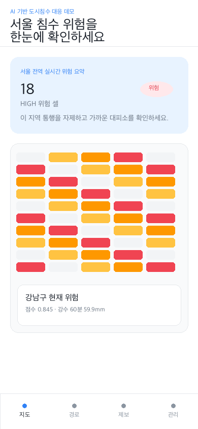

# 서울 도시침수 대응 데모 웹

Next.js fullstack 단일 코드베이스로 만든 서울 25개 자치구 대상 도시침수 대응 데모입니다. `deep-research-report.md`는 참고 리서치로 두고, 구현 기준은 `.omc/specs/deep-interview-seoul-flood-demo.md`, `.omc/plans/seoul-flood-demo-plan.md`, `DESIGN.md`입니다.

## 핵심 기능

- 시민 화면: Kakao Map 기반 서울 전역 위험 셀, 레이어 토글, 현재 위치 행동 카드, 가까운 대피소, 사진 포함 익명 제보
- 안전경로: 출발/도착 기준 경로가 HIGH 셀을 지나는지 검사하고 경고 및 우회 후보 표시
- 운영자 콘솔: `/admin` 비밀번호 인증, Top 20 위험 셀, 최근 제보 50건, API 수집 헬스 표
- 수집: GitHub Actions 5분 cron → `/api/ingest/all`, Vercel Cron 일일 cleanup → `/api/cron/cleanup`
- DB: Supabase PostgreSQL + PostGIS, Storage private bucket 사진 업로드 + signed URL 7일
- fallback: DB/API 미연결 로컬에서도 데모 데이터로 화면·API·테스트가 동작

## 시스템 다이어그램

```mermaid
flowchart LR
  GH[GitHub Actions cron\n5분] --> Ingest[/api/ingest/all]
  Vercel[Vercel Cron\n매일 04:00 KST] --> Cleanup[/api/cron/cleanup]
  KMA[KMA 초단기] --> Ingest
  Seoul[서울시 하천/하수] --> Ingest
  TOPIS[TOPIS 도로\n옵션] --> Ingest
  Ingest --> Risk[룰베이스 위험 산정]
  Risk --> DB[(Supabase Postgres + PostGIS)]
  DB --> Public[시민 지도]
  DB --> Admin[운영자 콘솔]
  Public --> Reports[익명 제보]
  Reports --> DB
```

## 위험도 산정 공식

점수는 0.0~1.0이며 코드 위치는 `packages/risk/scoring.ts`입니다.

```txt
score = rain*0.35 + river*0.20 + drain*0.20 + floodOverlay*0.20 + road*0.05
rain = max(rain10m/15mm, rain30m/35mm, rain60m/55mm)
drain = drainSaturation*0.7 + drainRise*0.3
level = SAFE(<0.22), LOW(0.22~0.46), MEDIUM(0.46~0.72), HIGH(>=0.72)
```

TOPIS 키가 없으면 `road=0` fallback으로 동작하며 점수 영향은 최대 0.05입니다.

## 환경변수

`.env.local`은 이미 로컬에 준비되어 있으며 git에 커밋하지 않습니다. 배포 시 Vercel Production/Preview/Development에 동일하게 등록합니다.

| 변수 | 용도 | 필수 |
| --- | --- | --- |
| `DATABASE_URL` | Supabase pooler 연결, 앱 런타임 쿼리 | 배포 필수 |
| `DIRECT_URL` | 스키마 적용/시드 전용 direct 연결 | 운영 준비 필수 |
| `SUPABASE_URL` | Supabase API URL | 사진 업로드 시 필수 |
| `SUPABASE_ANON_KEY` | Supabase anon key | 선택 |
| `SUPABASE_SERVICE_ROLE_KEY` | 서버 전용 Storage/DB 권한 | 사진 업로드 시 필수 |
| `SUPABASE_STORAGE_BUCKET` | private 사진 bucket, 기본 `reports-photos` | 선택 |
| `KMA_KEY` | 초단기실황/예보 API | 실데이터 수집 필수 |
| `SEOUL_KEY` | 하천/하수/정적 데이터 API | 실데이터 수집 필수 |
| `TOPIS_KEY` | 도로 소통/돌발 | 선택, 미설정 시 fallback |
| `KAKAO_REST_KEY` | 주소→좌표 변환 | 안전경로 고도화 필수 |
| `NEXT_PUBLIC_KAKAO_JS_KEY` 또는 `KAKAO_JS_KEY` | Kakao Map JavaScript public key. 전자는 build-time public env, 후자는 `/api/config/public` 런타임 공급 alias | 지도 고도화 필수 |
| `KAKAO_MOBILITY_KEY` | Mobility 길찾기 | 선택, 미설정 시 haversine fallback |
| `ADMIN_PASSWORD` | `/admin` 인증 | 필수 |
| `SESSION_SECRET` | admin session 서명 | 필수 |
| `INGEST_TOKEN` | ingest endpoint 보호 | 필수 |
| `IP_SALT` | 제보 rate limit IP hash | 필수 |
| `INGEST_FETCH_TIMEOUT_MS` | 외부 API timeout, 기본 8000 | 선택 |

> 주의: `NODE_ENV`는 Vercel/Next.js가 자동 설정하므로 Vercel Environment Variables에 등록하지 마세요. `NODE_ENV=development`가 배포 환경에 들어가면 `next build`의 `/404` prerender에서 `<Html> should not be imported outside of pages/_document` 오류가 발생할 수 있습니다. 이 저장소의 `build` script는 방어적으로 `NODE_ENV=production`을 강제합니다.

## 로컬 실행

```bash
pnpm install
pnpm dev
```

DB 없이도 demo fallback으로 실행됩니다. Supabase를 연결하려면:

```bash
pnpm db:schema
pnpm seed:demo
pnpm dev
```

## 주요 API

- `GET /api/risk/cells?bbox=minLng,minLat,maxLng,maxLat&zoom=14`: 위험 셀. bbox > 50km² 또는 zoom < 14이면 `X-Auto-Aggregated: true`로 자치구 집계 반환
- `GET /api/static/layers`: 침수예상도, 대피소, 빗물펌프장, 하천 수위계, 도로 통제 정적 레이어
- `POST /api/reports`: JSON 또는 multipart/form-data 제보. `Content-Length > 1.5MB`는 413, 사진은 private Storage에 업로드 후 7일 signed URL 저장
- `POST /api/route`: HIGH 셀 통과 경고 및 fallback 직선/haversine 경로
- `POST /api/ingest/all`: `X-Ingest-Token` 보호, 외부 API health와 `external_snapshots` 저장 후 위험 셀 upsert

## 검증 명령

```bash
pnpm test
pnpm typecheck
pnpm build
```

## 배포

1. Vercel 프로젝트 생성 후 GitHub repository 연결
2. Vercel env에 `.env.local` 값을 등록 (`NEXT_PUBLIC_KAKAO_JS_KEY` 권장, 누락 시 `KAKAO_JS_KEY`도 `/api/config/public`로 런타임 공급 가능)
3. Supabase SQL Editor 또는 `pnpm db:schema`로 `db/schema.sql` 적용
4. GitHub Actions Secrets 등록
   - `DEPLOY_URL=https://<vercel-domain>`
   - `INGEST_TOKEN=<same-as-vercel>`
5. Kakao Developers Web platform에 `http://localhost:3000`, `https://*.vercel.app`, 실제 도메인 등록
6. `/api/health`, `/api/risk/cells`, `/admin`에서 smoke check

## 외부 API 키 발급 절차

- KMA: 공공데이터포털 → `기상청 단기예보 조회서비스` 활용신청 → 일반 인증키(Decoding)를 `KMA_KEY`에 입력
- 서울시: 서울 열린데이터광장 → 인증키 신청 → `SEOUL_KEY` 입력
- TOPIS: 실시간 도로 소통/돌발 정보 신청 → `TOPIS_KEY` 입력, 없으면 fallback 허용
- Kakao: Kakao Developers → 앱 생성 → REST API 키/JavaScript 키 입력 → Web domain whitelist 등록. JavaScript 키는 `NEXT_PUBLIC_KAKAO_JS_KEY`로 넣는 것을 권장하고, Vercel build-time public env 누락을 피하려면 동일 값을 `KAKAO_JS_KEY` alias로도 넣을 수 있습니다.
- Supabase: Project → Settings → Database/API/Storage 값 입력, `postgis` extension 활성화

## Security / Secret 회전

시연 직전 아래 4개는 1회 회전합니다.

```bash
openssl rand -hex 32  # ADMIN_PASSWORD
openssl rand -hex 32  # SESSION_SECRET
openssl rand -hex 32  # INGEST_TOKEN
openssl rand -hex 32  # IP_SALT
```

`.env*`는 `.gitignore` 대상입니다. 외부 발급 키(KMA, SEOUL, TOPIS, Kakao)는 회전 대상이 아닙니다.

## 디버깅 체크리스트

- Vercel Logs: `/api/ingest/all`, `/api/route`, `/api/reports` 함수 로그 확인
- GitHub Actions: `ingest` workflow의 curl status와 secret 누락 확인
- Supabase Logs: Postgres connection pool, Storage private bucket 권한 확인
- Kakao 지도 미표출: `/api/config/public`의 `hasKakaoJsKey=true` 여부와 Kakao Developers Web platform domain whitelist 확인

## 시연 GIF/영상



위 GIF는 시민 요약, 지도 레이어, 안전경로, 익명 제보, 운영자 콘솔의 30초 시연 흐름을 담은 로컬 생성 자산입니다. 배포 URL 확정 후 실제 브라우저 녹화본으로 교체할 수 있습니다.
