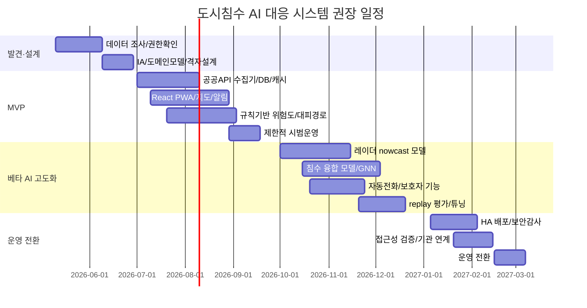

# AI 기반 도시침수 예측·대응 웹 시스템 구현 계획

## 집행 요약

이 시스템의 목표는 단순히 “비가 오니 조심하세요”를 보내는 앱이 아니라, **초단기 강수 예측 + 소구역 침수위험 산정 + 행동지침 + 안전경로 + 고령층용 다중 채널 알림 + 시민제보 + 운영자 대시보드**를 한 번에 묶는 **도시침수 대응 플랫폼**을 만드는 것입니다. 한국에서는 이미 entity["organization","행정안전부","south korea"]가 운영하는 재난문자방송(CBS)이 존재하므로, 민간·캠퍼스·프로젝트형 서비스가 같은 역할을 반복하면 차별성이 약합니다. 따라서 본 계획은 **CBS를 대체하지 않고 보완**하는 방향, 즉 서울의 하천·하수·교통·대피소·센서 데이터를 결합해 **동네 단위 행동 지침**을 제공하는 방향을 전제로 합니다. 재난문자는 “광역 경보”, 이 시스템은 “미세 지역 대응”에 집중해야 합니다. citeturn27search0turn27search1turn8view1turn34search4

핵심 결론은 세 가지입니다. 첫째, entity["city","서울특별시","south korea"]와 entity["organization","기상청","south korea"], entity["organization","한강홍수통제소","south korea"]가 이미 공개한 데이터만으로도 **MVP 수준의 소구역 침수위험·대응 시스템**은 충분히 구현 가능합니다. 둘째, **디지털 트윈은 유용하지만 MVP 필수 요소는 아닙니다**. 서울의 S-Map은 3차원 시뮬레이션·진단·예측 기능과 API 제공 계획을 밝히고 있으나, 외부 개발자가 바로 활용할 수 있는 공개형 3D API 문서는 아직 제한적이므로, 1단계는 2D 기반 PWA로 시작하고 3단계 이후에 디지털 트윈 연계를 붙이는 것이 현실적입니다. 셋째, 가장 중요한 기술적 포인트는 **레이더 기반 초단기강수(nowcast)와 하수·하천 수위, 교통 통제, 시민 제보를 결합한 위험 융합 모델**입니다. citeturn32search1turn32search2turn35view2turn35view3turn6search7turn6search9

예산이 특정되지 않았으므로, 본 보고서는 **오픈소스 중심의 백엔드와 공공 API 우선 전략**을 권고합니다. 프런트엔드는 사용자가 요청한 대로 **React + TypeScript + Tailwind + shadcn/ui**를 사용하고, 배포 형태는 **웹 우선 PWA**가 가장 합리적입니다. 그 이유는 빠른 배포, 접근성 개선, 저사양 단말 대응, 링크 공유, 긴급시 웹으로 즉시 진입 가능한 장점이 있기 때문입니다. 다만 **푸시 권한·자동통화·오프라인 캐시**까지 고려하면 PWA와 서버 측 SMS/음성 발신을 함께 설계해야 합니다. citeturn19view0turn20view0turn21search1turn24search1

## API 우선순위와 채택 전략

### 공공·준공공 데이터 API 우선순위

| 우선순위 | 카테고리 | 공급자 | API/데이터명 | 대표 엔드포인트 | 데이터 형태 | 갱신 주기 | 비용·한도 | 접근 요건 | 예시 사용 | 근거 |
|---|---|---|---|---|---|---|---|---|---|---|
| A | 기상 실황·초단기예보 | entity["organization","기상청","south korea"] | 단기예보 조회서비스 | `.../VilageFcstInfoService_2.0/getUltraSrtNcst`, `.../getUltraSrtFcst` | 격자형 실황/예보, JSON/XML | 초단기 운영 주기 기준 갱신 | 무료, 개발계정 일 10,000건 수준 | 공공데이터포털 활용신청·인증키 | 5~60분 단위 강우/기온/풍속 예보로 셀 위험도 갱신 | 공식문서 citeturn2search0turn2search7turn2search8turn2search9 |
| A | 레이더 영상·강수량 | 기상청 | 레이더영상 조회서비스 / 레이더강수량(HSR) 조회서비스 | `.../RadarImgInfoService/getCmpImg`, HSR APIHub 파일목록 조회 URL(상세 하위 URI는 공식 포털에서 확인) | 합성·개별 레이더 영상, HSR 강수량 텍스트/파일 | 레이더영상 실시간, HSR 5분 생산 | 무료, 레이더영상 개발계정 10,000건 | 공공데이터포털 + APIHub 계정 | 5분 간격 강수 nowcast 입력값 생성 | 공식문서 citeturn35view2turn35view3 |
| A | 하천 수위 | 서울특별시 | 서울시 하천 수위 현황 | `http://openAPI.seoul.go.kr:8088/{KEY}/xml/ListRiverStageService/1/5/` | 수위계명·하천명·수위·제방고 등 | 10분 단위, 최신 데이터 제공 | 무료 | 서울 열린데이터광장 키 | 하천 범람 위험, 하천 인접 셀 위험도 보정 | 공식문서 citeturn32search1 |
| A | 하수관로·내수 수위 | 서울특별시 | 서울시 하수관로 수위 현황 | `openapi.seoul.go.kr:8088/{KEY}/xml/DrainpipeMonitoringInfo/...` | 고유번호·측정일자·측정수위·통신상태 | 실시간성 운영, Sheet는 최근 1시간 | 무료 | 서울 열린데이터광장 키 | 내수침수 선행징후, 맨홀·관로 역류 감지 | 공식문서 citeturn32search2turn30view1 |
| A | 국가 수문·홍수예보 | entity["organization","한강홍수통제소","south korea"] | 표준수문DB / WAMIS / 강우레이더 영상 정보 | 실시간 수위 페이지 `wkw/wl_dubwlobs.do`, 강우레이더 관련 URL `wamisweb/gis...`; 통합 OpenAPI는 `HydroType=waterlevel/rainfall...` 파라미터 사용, 상세 호출 URI는 공개 스니펫 기준 unspecified | 수위·유량·강우·댐·보·홍수예보·레이더 URL | 실시간 | 무료, 트래픽 정책 기관 기준 | 기관 발급 OpenAPI 키 또는 공개 페이지 | 서울 외 유역 영향, 상류 유입 상황, 홍수예보 보강 | 공식문서 citeturn37search1turn37search2turn37search5turn39search0turn39search2 |
| A | 침수예상·펌프장·대피자산 | 서울특별시 | 풍수해 침수예상도 공간정보 / 빗물펌프장 공간정보 / 수해대피소·풍수해 대피경로 | 펌프장 `http://openapi.seoul.go.kr:8088/{KEY}/xml/rainPump/1/5/`; 침수예상도·대피경로·수해대피소 세부 URI는 공개 스니펫 기준 unspecified | 공간정보, 좌표계(EPSG:5186), 자산·대피 정보 | 수시(자료변경시) | 무료 | 서울 열린데이터광장 키 | 정적 위험 기저지도로 사용, 대피 경로 추천, 대응자산 표시 | 공식문서 citeturn33search0turn34search1turn33search4turn33search5turn33search10 |
| A | 교통·현장 통제·도시센서 | entity["organization","TOPIS","seoul traffic system"] / 서울특별시 / entity["organization","KETI","south korea"] | TOPIS 실시간 도로소통·돌발정보 / S-DoT 환경정보 / Mobius(oneM2M) | TOPIS Open API는 서울 열린데이터광장 통해 신청, 실시간 도로소통·돌발 API 제공; S-DoT 예시 `http://openapi.seoul.go.kr:8088/{KEY}/xml/IotVdata017/1/5/`; Mobius는 oneM2M HTTP/MQTT 리소스 모델 | 도로 소통·사고·센서 관측값·IoT 이벤트 | TOPIS 실시간, S-DoT 수시·시간 단위, Mobius는 센서 정책 기준 | 무료 또는 자체 인프라 비용 | TOPIS/열린데이터 키, Mobius 서버 구축 또는 기관 연동 | 침수로 인한 도로 차단 보정, 시민제보 검증, 센서 확장 수용 | 공식문서 citeturn8view1turn7search0turn9search3turn30view2turn10search0turn10search5turn10search6 |

이 표에서 중요한 점은 **MVP에 필요한 대부분의 기상·수문·공간 자산은 이미 공공데이터로 확보 가능**하다는 것입니다. 특히 서울시는 하천 수위, 하수관로 수위, 빗물펌프장, 풍수해 침수예상도, 수해대피소 등 도시침수 대응에 필요한 핵심 레이어를 이미 제공하고 있고, 한강홍수통제소는 상류 수문·강우·홍수예보 계열 데이터를 보강해 줍니다. 즉, “새 데이터를 다 깔아야 하는 프로젝트”가 아니라, **이미 공개된 도시 운영 데이터를 묶어 실시간 의사결정 체계로 바꾸는 프로젝트**에 가깝습니다. citeturn32search1turn32search2turn33search0turn33search4turn37search1turn34search4

### 상용·보조 API 우선순위

| 우선순위 | 카테고리 | 공급자 | API명 | 대표 엔드포인트 | 데이터/기능 | 갱신·특성 | 비용·한도 | 접근 요건 | 예시 사용 | 근거 |
|---|---|---|---|---|---|---|---|---|---|---|
| A | 지도·주소변환·행정구역 변환 | entity["company","카카오","south korea"] | Kakao Local API / Maps JS SDK | `https://dapi.kakao.com/v2/local/search/address.${FORMAT}` `https://dapi.kakao.com/v2/local/geo/coord2address.${FORMAT}` `https://dapi.kakao.com/v2/local/geo/coord2regioncode.${FORMAT}` | 주소→좌표, 좌표→주소, 행정구역, 지도 렌더링 | 국내 주소 체계 대응 | 월간 전체 300만 무료 쿼터, 로컬 일 10만, JS 지도 일 30만; 초과 시 유료 과금 | Kakao Developers 앱 생성·REST API 키·카카오맵 사용 설정 | 신고 위치 정규화, 보호자 주소 등록, 마커·행정동 기반 경보 | 공식문서 citeturn40view0turn45search0turn45search1turn45search2 |
| B | 지도 대체안·정적/동적 지도 | entity["company","네이버클라우드","cloud service korea"] | Maps / Geocoding / Reverse Geocoding / Directions 5 | Geocoding 예시 `https://naveropenapi.apigw.ntruss.com/map-geocode/v2/geocode`; Directions 5 세부 base URI는 retrieved text 기준 unspecified | 동적·정적 지도, 주소검색, 역지오코딩, 차량 길찾기 | IAM 인증 기반, 실시간 교통 반영 경로 | API별 월 무료 이용량 3,000~6,000,000건 범위 FAQ 안내 | Ncloud 계정·API Gateway IAM 인증 | 카카오 장애 시 지오코딩 백업, 차량 우회경로 보조 | 공식문서 citeturn12search0turn13search0turn13search4turn44search6turn44search9 |
| A | 웹 푸시 알림 | entity["company","Google","technology company"] | Firebase Cloud Messaging | SDK 기반 Web Push, VAPID 필요 | 푸시 토큰 발급, 브라우저 푸시, 주제/세그먼트 발송 | 웹 브라우저 푸시에 적합 | FCM no-cost | Firebase 프로젝트, 서비스워커, VAPID 키 | 위험도 상승·대피권고·보호자 알림 | 공식문서 citeturn19view0turn20view0turn20view2turn20view3 |
| A | SMS 대체 채널 | 네이버클라우드 | Simple & Easy Notification Service | SMS Send API(정식 Request URI는 SENS 문서에 명시, retrieved text 기준 URI 본문 미포착) | SMS/LMS/MMS, 카카오 비즈메시지, SMS failover | 예약 발송·실패 대체발송 가능 | SMS 50건 이하 무료, LMS 10건 이하 무료, 이후 사용량 기반(정확 단가 retrieved text 기준 unspecified) | Ncloud 프로젝트·인증서/발신번호 등록 | 고령층·피처폰·푸시 미동의 사용자 통지 | 공식문서 citeturn22view0turn23view1turn23view4 |
| A | 음성 자동호출 | entity["company","Twilio","cpaas us"] | Programmable Voice | Calls resource 사용, SDK/REST 기반 아웃바운드 콜 | 자동 음성통화·응답감지·음성재생 | 서버에서 즉시 발신 가능 | 한국 outbound 기준 분당 과금, 기능별 추가비용 | Twilio 계정·발신번호·TwiML/앱 설정 | 고령층 자동전화, 무응답 시 보호자 에스컬레이션 | 공식문서 citeturn24search0turn24search1 |
| B | TTS 음성 생성 | 네이버클라우드 | CLOVA Voice | TTS Premium API(세부 URI retrieved text 기준 unspecified) | 자연스러운 한국어 음성 합성 | 한국어 음성 품질 강점 | 사용량 기반, 정확 단가 retrieved text 기준 unspecified | Ncloud 계정 | 자동전화용 음성 스크립트 생성 | 공식문서 citeturn21search3turn25search1 |
| A | 시민/관리자 인증 | 카카오 / entity["company","네이버","south korea"] / Google | 카카오 로그인 / NAVER Login / Firebase Authentication | Kakao OIDC metadata `https://kauth.kakao.com/.well-known/openid-configuration`; NAVER Login 인가코드·토큰 발급 API; Firebase Auth 웹 SDK | OAuth 2.0/OIDC, 이메일·소셜, 익명인증 지원 | 시민 가입 장벽 최소화 | Kakao는 토큰 발급 제한 존재, Firebase Auth는 업그레이드 시 과금 정책 변화 | 각 개발자 콘솔 등록·리디렉션 URI 설정 | 시민용 간편 로그인, 관리자용 별도 조직 IdP 연계 | 공식문서 citeturn26search0turn26search1turn26search7turn26search9turn26search5turn45search2 |

권장 조합은 다음과 같습니다. **핵심 공공데이터 레이어는 공공 API**, 지도·주소 계층은 **카카오 우선 / 네이버 백업**, 알림은 **FCM + SMS(SENS) + 자동전화(Twilio)**, 인증은 **카카오/네이버 소셜 로그인 + 익명 모드 + 관리자용 별도 조직 인증** 조합이 가장 현실적입니다. 이렇게 하면 재난문자와 겹치는 “전국민 동일 브로드캐스트”가 아니라, **지역·연령·채널 특성별 맞춤 대응**이 가능합니다. citeturn20view0turn22view0turn24search1turn26search0turn26search1

## 데이터 파이프라인과 실시간 아키텍처

이 시스템은 **배치 분석 시스템**이 아니라 **사건 중심(event-driven) 실시간 대응 시스템**으로 설계해야 합니다. nowcasting의 정의 자체가 현재부터 0~6시간 범위의 고해상도 단기 예측이며, 고영향 기상에서는 분 단위 반응 속도가 중요합니다. 기상청의 HSR은 5분 주기로 생산되고, 서울 하천 수위는 10분 단위, 레이더영상은 실시간으로 갱신됩니다. 따라서 데이터 처리 파이프라인도 1분 단위 스케줄·스트리밍 하이브리드 구조가 적합합니다. citeturn28search4turn28search12turn35view2turn35view3turn32search1

권장 파이프라인은 다음과 같습니다. **수집 계층**에서는 공공 API polling 작업과 센서/Webhook/MQTT 이벤트를 분리합니다. KMA·서울 열린데이터·TOPIS·한강홍수통제소는 1~5분 간격 pull, 시민 제보와 운영자 입력은 API push, IoT 게이트웨이는 MQTT/oneM2M subscription으로 받습니다. **전처리 계층**에서는 좌표계를 통일하고(EPSG:4326 또는 내부 분석용 EPSG:5186), 모든 입력을 50m~250m 셀 또는 하수·도로 그래프 노드로 재투영합니다. **피처 계층**에서는 최근 5/10/30/60분 누적강수, 상류 수위 변화율, 하수관로 상승 속도, 도로 혼잡/통제 상태, 과거 침수예상도 중첩, 지형 경사, 펌프장·대피소 거리, 시민 제보 신뢰도 등을 생성합니다. 이 과정에서 센서 품질검사(QC)와 이상치 제거가 반드시 들어가야 합니다. citeturn32search1turn32search2turn33search0turn33search4turn8view1turn9search3

실시간 아키텍처는 **수집 서비스 → 메시지 브로커 → 피처/모델 서비스 → 알림 서비스 → 클라이언트** 흐름으로 단순화하는 것이 좋습니다. 메시지 브로커는 Apache Kafka가 정석이지만, 초기에는 운영 복잡도를 줄이기 위해 **Redpanda** 또는 **NATS JetStream**도 충분합니다. 영속 저장은 **PostgreSQL + PostGIS + TimescaleDB 확장**으로 일원화하고, 대용량 레이더·CCTV 스냅샷·모델 아티팩트는 객체 스토리지에 저장합니다. Redis는 타일 캐시·최근 위험도 캐시·알림 디바운싱에 사용합니다. 목표 지연시간은 **데이터 수집 후 위험도 갱신 30~60초 이내**, **클라이언트 화면 반영 5초 이내**, **경로 재계산 2초 이내**, **심각도 상향 알림 송신 60초 이내**로 잡는 것이 합리적입니다. 이는 실무 운영 목표치이며, 실제 API 제공 주기에 따라 일부 구간은 더 길어질 수 있습니다. citeturn35view3turn32search1turn8view1

모델 호스팅은 **클라우드 우선, 엣지 보완**이 바람직합니다. 레이더 기반 강수 nowcast와 도시 단위 위험 융합은 GPU 또는 고성능 CPU가 필요한 경우가 많아 클라우드 추론이 적합하지만, **센서 QC, 단순 threshold rule, CCTV 1차 객체 판정, 네트워크 단절 시 fail-safe 알림**은 엣지 게이트웨이에서도 동작해야 합니다. oneM2M 기반 Mobius는 HTTP/MQTT와 subscription/notification, JSON 리소스 모델을 지원하므로, 지자체 센서망이나 학교·구 단위 시험망을 붙일 때 무난한 어댑터 계층이 될 수 있습니다. citeturn10search0turn10search5turn10search6

보안은 기능만큼 중요합니다. 위치·연락처·제보 사진·음성은 모두 민감한 운영데이터이므로, 기본 원칙은 **최소수집·최소보관·목적제한**입니다. 시민 위치는 실시간 라우팅에 필요한 기간만 유지하고, 이력 분석은 격자 단위로 익명화합니다. 인증은 OIDC/OAuth 2.0 기반으로 통일하고, 관리자 권한은 RBAC로 세분화합니다. 내부 API는 mTLS 또는 최소한 private network + JWT 검증 체계를 사용하고, 비밀키는 Secret Manager에 저장하며, 제보 이미지와 CCTV 스냅샷 접근은 서명 URL로 제한합니다. 웹 클라이언트에는 rate limit, reCAPTCHA 대체 장치, 앱 위변조 방지를 위한 App Check 유사 정책을 적용하는 것이 좋습니다. citeturn26search9turn26search5turn20view0

## 예측 모델과 알고리즘 제안

### 모델 전략

도시침수 대응에서 가장 큰 실수는 “하나의 거대한 AI 모델”로 문제를 끝내려는 것입니다. 실제 구현은 **두 단계 모델링**이 더 안정적입니다. 첫 단계는 **강수 nowcast**, 둘째 단계는 **침수 위험 융합 모델**입니다. nowcasting은 세계기상기구(entity["organization","WMO","un weather org"]) 기준으로 0~6시간 범위의 상세 단기 예측이며, 원 논문에서도 ConvLSTM은 강수 nowcasting에서 FC-LSTM과 ROVER를 지속적으로 앞섰습니다. 반면 도시침수는 강수만으로 결정되지 않고, 하수 네트워크 상태, 지형, 펌프, 도로 차단, 시민 체감 정보가 함께 영향을 줍니다. 따라서 **강수 예측과 침수 영향 예측을 분리**하는 편이 운영 리스크가 낮습니다. citeturn28search4turn28search12turn28search0

권장 조합은 다음과 같습니다. **베이스라인**은 규칙 기반(threshold) + LightGBM/XGBoost, **주력 모델**은 레이더 기반 ConvLSTM/U-Net 계열 nowcast, **도시침수 융합 모델**은 그래프 기반 GNN 또는 Graph-WaveNet 계열입니다. Graph-WaveNet은 도시 우수관망 상태 예측에 적용된 사례가 있고, 공간-시간 그래프 딥러닝은 물리 기반 피처와 human-sensed feature를 함께 사용할 때 urban flood nowcasting에 유효하다는 연구가 있습니다. 즉, 레이더 예측 오차가 존재하더라도 **관로 상태·시민 제보·도로 네트워크를 함께 읽는 그래프 모델**이 실제 대응성능을 높일 가능성이 큽니다. citeturn28search3turn28search7turn28search15

### 입력 변수와 라벨 설계

입력 변수는 네 부류로 나누는 것이 좋습니다. 첫째, **기상 입력**: KMA 레이더영상, HSR 5분 레이더강수량, 초단기실황, 초단기예보. 둘째, **수문·배수 입력**: 서울 하천 수위, 하수관로 수위, 한강홍수통제소 수위·유량·강수량. 셋째, **정적 공간 입력**: 침수예상도, 침수흔적도, 경사·저지대·불투수면, 빗물펌프장·수해대피소·풍수해 대피경로. 넷째, **운영·인간센서 입력**: TOPIS 실시간 도로소통·돌발, 시민 제보, CCTV 추론 결과, 보호자/고령층 알림 실패 여부입니다. citeturn35view2turn35view3turn32search1turn32search2turn37search1turn33search0turn8view1turn7search0

라벨은 가능하면 **연속형 + 이진형**을 함께 가져가야 합니다. 가장 실용적인 라벨 세트는 다음과 같습니다. `y1`: 셀 단위 침수 위험도(0~1), `y2`: 셀 단위 예상 침수심(회귀), `y3`: 30분 내 통행불가 확률, `y4`: 대피 필요 여부, `y5`: 알림 우선순위 등급. 실제 관측 라벨이 희소하므로, 1단계에서는 **서울시 침수흔적도·도로통제·하수 수위 상승 이벤트·시민제보 검증 케이스**를 라벨로 사용하고, 2단계에서는 SWMM/dual-drainage 기반 시뮬레이션 결과를 약한 라벨(weak label)로 결합하는 것이 바람직합니다. 도시 배수 예측과 도시 플uvial flood modelling 연구에서도 실시간 강우 nowcast와 도시 배수/dual drainage 연계가 핵심으로 제시됩니다. citeturn4search12turn32search2turn29search2turn29search21turn28search6

### 평가 지표와 배포 방식

평가 지표는 문제 유형별로 나눠야 합니다. 강수 nowcast는 **CSI/Critical Success Index, POD, FAR**와 같은 임계강수 기준 성능지표가 중요하고, 침수 위험 분류는 **AUROC, AUPRC, F1, calibration**, 침수심 회귀는 **MAE/RMSE**, 대응 관점에서는 **lead time gain**, 즉 “침수 10~30분 전에 얼마나 안정적으로 경고했는가”가 핵심입니다. 시민 경험 측면에서는 예측 정확도만큼 **오경보율(false alarm rate)** 관리가 중요합니다. 재난문자와 비교될 가능성이 크기 때문에, 이 서비스는 “더 자주 울리는 앱”이 아니라 “더 구체적이고 실용적인 행동지침을 주는 앱”이어야 합니다. citeturn28search0turn28search7turn28search3

배포는 **클라우드 학습·클라우드 추론 + 엣지 fail-safe**가 적절합니다. 모델 학습은 GPU가 있는 클라우드에서 수행하고, 추론도 우선 클라우드에서 운영합니다. 다만 구청·캠퍼스·현장 게이트웨이에는 threshold 모델과 최근 위험도 캐시를 내려 보내 네트워크 단절 시에도 “하수 수위 급상승 + 레이더 강수 급증”과 같은 룰 기반 고위험 알림은 유지해야 합니다. CCTV 기반 침수 탐지는 개인정보·연산비용을 고려하면 **프레임 저장형이 아니라 이벤트 추출형**으로 설계하는 것이 좋습니다. citeturn10search5turn35view3turn35view2

## 백엔드 스택과 API 계약

### 권장 백엔드 구성

가장 현실적인 스택은 **NestJS + FastAPI 이원화**입니다. NestJS는 인증·권한·알림·외부 API 연동·운영자용 REST/WS API를 맡고, FastAPI는 피처 생성·모델 추론·배치 재학습·실험 API를 맡습니다. 데이터베이스는 **PostgreSQL + PostGIS + TimescaleDB**, 메시지 브로커는 **Redpanda 또는 Kafka**, 캐시는 **Redis**, 객체 저장은 S3 호환 스토리지를 권장합니다. 모델 관리에는 **MLflow** 또는 BentoML, 배포는 **Kubernetes** 또는 Managed Container를 권장합니다. 이 조합은 Python ML 생태계와 TypeScript 웹 생태계를 무리 없이 연결합니다.

권장 저장소 분리는 다음과 같습니다. `ops_db`는 사용자·알림·설정·제보 메타데이터, `geo_db`는 정적 공간 레이어, `ts_db`는 시계열 센서·예측·알림 이력, `obj_store`는 레이더 이미지·제보 사진·모델 파일입니다. 분석 단위는 **격자(cell)** 와 **그래프(node/edge)** 를 병행합니다. 격자는 사용자 화면에 직관적이고, 그래프는 하수관망·도로망 예측에 유리합니다.

### 샘플 API 계약

다음 계약은 MVP 기준 권장안입니다.

```http
GET /api/v1/risk/cells?bbox={minLon,minLat,maxLon,maxLat}&ts=2026-05-06T14:00:00+09:00
Authorization: Bearer <JWT>

Response 200
{
  "generatedAt": "2026-05-06T14:00:21+09:00",
  "horizonMin": 30,
  "cells": [
    {
      "cellId": "5174-1270-100m-001",
      "riskScore": 0.82,
      "riskLevel": "HIGH",
      "expectedDepthCm": 18,
      "explanations": ["강수 급증", "하수 수위 상승", "저지대", "도로 통제 인접"]
    }
  ]
}
```

```http
GET /api/v1/routes/safe?origin=37.561,126.991&destination=37.570,126.976&profile=walk
Authorization: Bearer <JWT>

Response 200
{
  "routeId": "safe-route-123",
  "distanceM": 1430,
  "durationSec": 1260,
  "riskPenalty": 0.14,
  "segments": [
    { "edgeId": "rd-001", "riskLevel": "LOW" },
    { "edgeId": "rd-002", "riskLevel": "MEDIUM" }
  ],
  "alternatives": [
    { "routeId": "safe-route-124", "durationSec": 1400, "riskPenalty": 0.08 }
  ]
}
```

```http
POST /api/v1/reports
Authorization: Bearer <JWT or Anonymous-Token>
Content-Type: application/json

{
  "category": "WATERLOGGING",
  "location": { "lat": 37.568, "lon": 126.989 },
  "depthEstimateCm": 20,
  "mobilityImpact": ["wheelchair_blocked", "car_impassable"],
  "description": "골목 진입 불가",
  "attachments": ["obj://report/2026/05/06/r1.jpg"]
}
```

```http
POST /api/v1/alerts/subscriptions
Authorization: Bearer <JWT>

{
  "channels": ["web_push", "sms", "voice_call"],
  "regions": ["home", "work", "care_target"],
  "threshold": "HIGH",
  "elderlyMode": true,
  "caregiverPhone": "encrypted"
}
```

```ws
WS /ws/live
{
  "type": "SUBSCRIBE",
  "topics": ["risk_cells", "road_closures", "alerts", "reports"]
}
```

인증은 일반 사용자용으로 **Kakao/Naver OAuth + 익명토큰**, 보호자·취약계층 관리용으로 **강화된 본인확인**, 관리자용으로 **OIDC 기반 조직 인증**을 권장합니다. 익명 제보는 허용하되, 스팸 방지를 위해 디바이스 토큰·rate limit·허니팟·사진 해시 중복검사를 넣어야 합니다. 시민 개인의 실시간 위치는 서버에 영구 저장하지 말고 세션 단위로만 보유하는 것이 좋습니다. citeturn26search0turn26search1turn26search5turn45search2

## 프런트엔드 구조와 현장 UX

### React 아키텍처

프런트엔드는 **React + TypeScript + Tailwind + shadcn/ui**에 **TanStack Query + Zustand + React Router + MapLibre GL 또는 Kakao Maps JS 래퍼** 조합을 권장합니다. Next.js도 가능하지만, 초기 MVP와 PWA 성격을 고려하면 **Vite 기반 SPA + 서비스워커**가 더 단순합니다. 다만 SEO나 SSR이 중요한 공공 공개 페이지가 있으면 정보 페이지 부분만 별도 SSR로 분리해도 됩니다.

컴포넌트 분해는 다음이 적절합니다. `MapShell`, `RiskLegend`, `NowcastTimeline`, `SafeRoutePanel`, `AlertCenter`, `ElderModeToggle`, `CitizenReportComposer`, `ShelterCard`, `RoadClosurePanel`, `CaregiverDashboard`, `OpsConsole`, `IncidentFeed`, `SensorHealthPanel`, `VoiceCallStatus`. 이 중 고령층 대상 화면은 별도 레이아웃을 두는 것이 좋습니다. 같은 기능을 “일반 모드”와 “안심 모드”로 나누면, 고령층 사용자는 복잡한 지도를 생략하고 **현재 위험, 해야 할 행동, 가장 가까운 안전지점, 전화 연결**만 크게 보여줄 수 있습니다.

### 상태관리와 지도 통합

상태는 세 층으로 나누는 것이 안정적입니다. 서버 상태는 TanStack Query, 세션/UX 상태는 Zustand, 대용량 지도 상태는 map store로 분리합니다. 지도는 위험 셀을 vector tile 또는 protobuf로 내려보내고, 5분마다 전체를 새로 그리는 대신 **변경 타일만 갱신**해야 합니다. 확대 수준에 따라 셀 해상도를 바꾸고, 저대역폭 모드에서는 **지도 대신 리스트형 위험 카드**를 우선 제공합니다. 교통·침수·대피소 레이어는 사용자가 직접 켜고 끌 수 있게 하되, 심각 경보 단계에서는 필수 레이어를 강제 강조하는 것이 좋습니다.

### 저대역폭·오프라인·고령층 접근성

이 프로젝트의 차별점은 접근성입니다. 웹이더라도 **고령층을 위한 사실상 “전화형 UI”**를 설계할 수 있습니다. 구체적으로는 큰 글씨, 한 문장 요약, 고대비, 깜빡임 최소화, 아이콘과 색만으로 의미를 전달하지 않는 설계, 한국어 평이문, 음성 읽기(TTS), 버튼 1~2개 중심의 인터랙션이 필요합니다. 또한 `응답 없음 → 자동 음성통화 → 보호자 통지 → 반복 미응답 시 지자체/기관 연락 안내` 흐름을 넣으면 재난문자와 명확히 구분되는 고령친화형 기능이 됩니다. 푸시를 받지 않는 사용자에게는 SMS, 문자도 읽지 못하는 사용자에게는 음성 자동호출이 백업 채널이 됩니다. citeturn20view0turn22view0turn24search1turn21search3

오프라인/저대역폭 모드는 필수입니다. 서비스워커로 최근 위험도 타일, 대피소 목록, 가정·직장 주변 경로 후보를 캐시하고, 네트워크가 끊기면 “마지막 동기화 시각”을 크게 노출해야 합니다. 저대역폭 모드에서는 배경지도 없이 텍스트형 카드로 전환하고, 이미지·CCTV는 수동 로딩으로 바꾸는 것이 좋습니다. 특히 재난상황에서는 지도가 멋진 것보다 **텍스트 행동지침이 먼저**여야 합니다.

### 시민제보 UI와 대표 사용자 흐름

시민제보는 단순 신고로 끝나면 안 됩니다. 제보 입력 항목은 `물높이(발목/무릎/차량바퀴)`, `통행 가능 여부(보행/유모차/휠체어/승용차)`, `위험요소(맨홀, 역류, 급류, 지하차도, 지하계단)`, `사진/짧은 음성`, `제보 시각` 정도로 제한하는 것이 좋습니다. 시스템은 제보 직후 자동으로 좌표 정규화, 같은 위치의 최근 제보 군집화, 레이더·하수·하천 데이터와 비교한 신뢰도 산정을 수행해야 합니다. 신뢰도 높은 제보는 위험 셀 산정에 반영하고, 낮은 제보는 운영자 검토 큐로 보냅니다.

대표 UI 흐름은 세 가지로 설계하면 충분합니다.

1. **시민 흐름**: 홈 진입 → 현재 위치 위험도 확인 → “지금 해야 할 행동” 카드 → 안전경로 보기 → 필요시 제보.
2. **고령층 흐름**: 홈 진입 → 큰 글씨 위험도/음성 안내 → “가까운 안전한 곳 전화로 안내받기” → 자동통화 또는 보호자 연결.
3. **운영자 흐름**: 상황판 → 위험 셀 상위 20개 → 하수/하천/도로 이벤트 상관 확인 → 경보정책 조정 → 현장 확인 요청.

## 기존 시스템 연계, 단계별 로드맵, 테스트와 운영

### 기존 시스템과의 연계 원칙

이 프로젝트는 **현재 서울·국가 시스템을 또 만드는 것**이 아니라, 현재 흩어진 시스템을 “대응 중심”으로 묶는 작업이어야 합니다. 기상은 KMA, 수문은 서울시/한강홍수통제소, 교통은 TOPIS, 대피 자산은 서울 안전 데이터, 넓은 의미의 디지털 트윈은 S-Map 계열과 연계합니다. 다만 현 시점 공개 자료상 S-Map은 3D 공간정보 연계·API 제공 “예정”이 명시되어 있으므로, 외부 팀이 즉시 붙일 수 있는 공개형 3D 인터페이스는 보수적으로 가정해야 합니다. 따라서 1~2단계는 **2D 운영지도 + 정적 공간정보 + 실시간 수문/기상**, 3단계부터 행정 협업 하에 S-Map 연계를 검토하는 순서가 맞습니다. citeturn6search7turn6search9turn34search4

재난문자와의 관계도 명확히 해야 합니다. CBS는 행정안전부가 운영하는 국가 경보 체계이며, 민간 웹앱이 직접 대신 보낼 수 있는 공개 API가 아닙니다. 따라서 본 시스템의 경보 체계는 **웹 푸시·SMS·음성통화**를 기본 채널로 하고, 심각도 최고 단계에서는 **“공공기관 경보체계를 통해 병행 전파되어야 할 사건”** 을 운영자 화면에 명시해 기관 전달 프로세스를 지원하는 방식이 현실적입니다. 즉, “국가 재난문자 fallback”은 기술 API가 아니라 **운영 프로토콜**에 가깝습니다. citeturn27search0turn27search1

### 단계별 구현 로드맵

| 단계 | 기간 | 핵심 산출물 | 사람월 추정 |
|---|---|---|---|
| 발견·설계 | 1~2개월 | 데이터 목록 확정, 서울/기관 데이터 접근 검증, 정보구조(IA), 위험 셀 스키마, 알림 정책 초안 | 2~3 PM |
| MVP | 3~5개월 | React PWA, KMA+서울시+TOPIS 연계, 100~250m 위험 셀, 규칙기반 경보, 대피소/우회경로, 시민 제보, FCM+SMS | 8~12 PM |
| 베타 AI 고도화 | 4~6개월 | ConvLSTM/optical flow nowcast, GNN/LightGBM 융합 모델, 자동전화, 보호자 대시보드, 운영자 콘솔, 재현실험(replay) | 12~16 PM |
| 운영 전환 | 3~4개월 | HA 배포, 관제모니터링, 보안감사, 접근성 검증, 모델 리스크 관리, 지자체 협업 연계, S-Map 검토 | 10~14 PM |

**총량 추정은 32~45 person-month** 수준입니다. 학생 프로젝트나 소규모 팀이라면 전체 시스템을 한 번에 구현하기보다, **MVP를 1개 자치구 또는 2~3개 침수취약 권역**에 한정하는 것이 현실적입니다. 예를 들어 종로·동작·강남 저지대 일부를 시범 권역으로 삼고, 정적 침수예상도 + 레이더 nowcast + 하수관로 수위 + 대피소 안내까지만 붙여도 충분히 의미 있는 결과물이 나옵니다.

### 최소기능제품 범위

MVP는 다음 범위로 제한하는 것이 좋습니다.

- 서울 일부 권역 전용.
- KMA 레이더/초단기예보, 서울 하천·하수 수위, TOPIS 도로 이벤트, 침수예상도/대피소만 사용.
- 예측 모델은 **규칙기반 + LightGBM**부터 시작.
- 고령층 채널은 **SMS 우선**, 자동전화는 베타 단계.
- 디지털 트윈 3D는 제외하고 2D 대응지도 우선.
- 제보는 사진 1장 + 깊이 추정 + 통행불가 여부 정도로 제한.

이 범위로도 재난문자와의 차별점은 충분합니다. 사용자는 “서울 전역 동일 문장”이 아니라 **내가 있는 셀의 위험도, 지금 가면 안 되는 길, 가장 가까운 대피 지점, 보호자 통지 여부**를 받게 되기 때문입니다.

### 테스트 계획과 운영·관제 계획

테스트는 반드시 **과거 호우 사건 replay 방식**으로 해야 합니다. 단위 테스트와 API 계약 테스트만으로는 재난 대응 시스템을 검증할 수 없습니다. 최소한 서울의 과거 호우일을 골라 당시 API 시계열을 재생하고, 시스템이 실제보다 몇 분 빨리/늦게 경고했는지를 측정해야 합니다. 테스트 축은 다섯 개가 필요합니다. 모델 정확도 테스트, 실시간 지연 테스트, 대량 알림 테스트, 지도 렌더링/저대역폭 테스트, 고령층 접근성 테스트입니다.

운영·모니터링은 `Prometheus + Grafana + Loki + OpenTelemetry` 계열이 무난합니다. 반드시 봐야 할 운영 지표는 **데이터 수집 성공률, 최신 데이터 지연, 셀 생성 지연, 알림 성공률, SMS/전화 실패율, 제보 적체 건수, 오경보율, 지역별 모델 드리프트**입니다. 배포는 blue-green 또는 canary가 바람직하고, 모델은 새 버전을 바로 전면 적용하지 말고 일부 권역 shadow inference를 거친 뒤 승격하는 방식이 안전합니다.



최종적으로, 이 시스템이 성공하려면 “AI 정확도”보다 **운영 설계**가 더 중요합니다. 이미 있는 재난문자와 차별화하려면, 예측 자체보다도 **소구역행동지침·경로 우회·고령층 다중채널·시민제보 검증·운영자 상황판**이 중심이 되어야 합니다. 기술적으로는 충분히 실현 가능하고, 서울·국가 공공데이터만으로도 1단계 구현은 가능합니다. 다만 **S-Map급 디지털 트윈은 후속 단계**, **CBS 연계는 기술 API가 아니라 기관 협업 프로토콜**, **MVP는 2D PWA와 공공 API 중심**으로 잡는 것이 가장 현실적이고 완성도 높은 전략입니다. citeturn6search7turn27search0turn32search1turn32search2turn35view3turn34search4